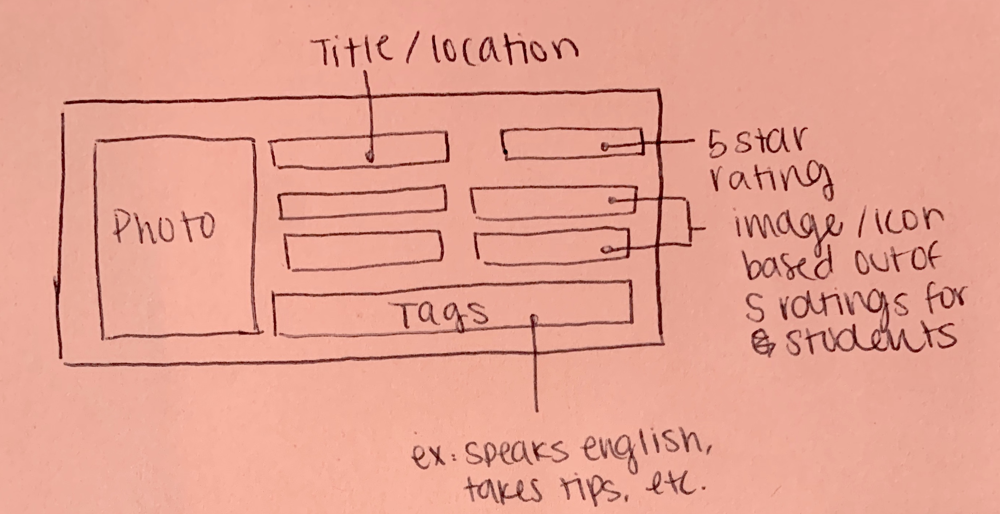
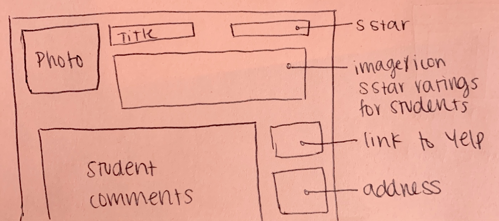
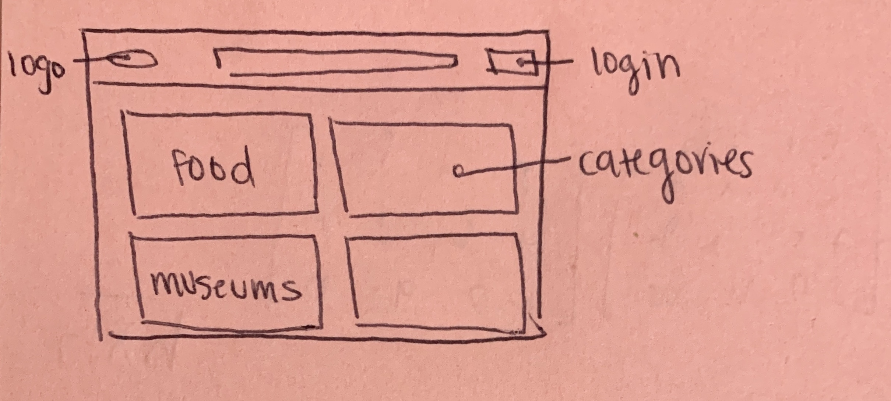
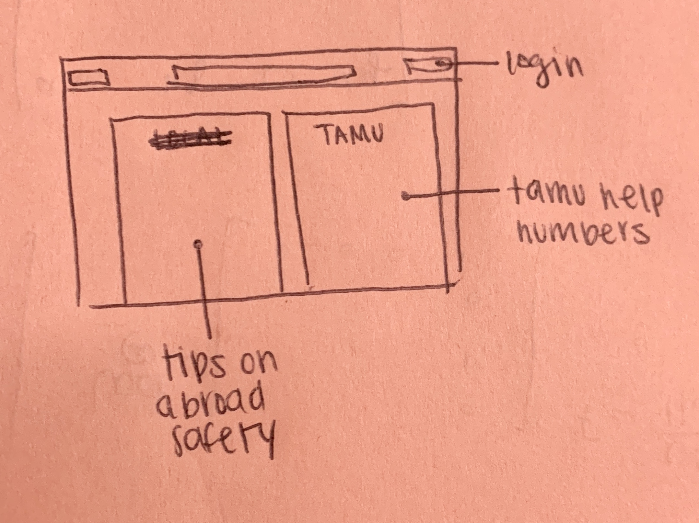
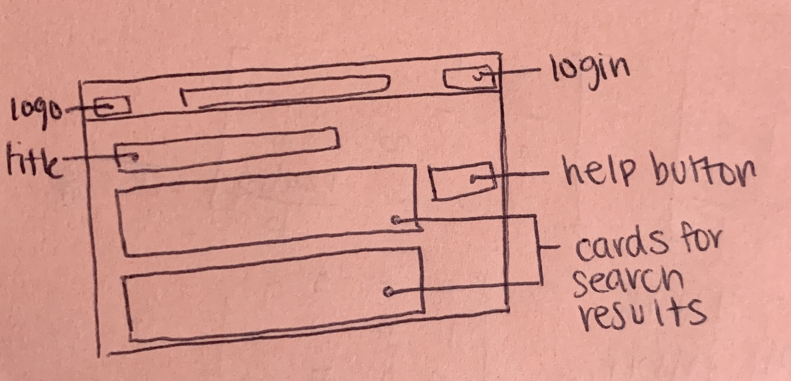

# Ritcheys-Rowdies
## Project Info
### Project Description
***Experience Recommendation / Review System:*** We need a private TripAdvisor / Yelp for small groups to use on study abroad trips. Students post "experiences" (restaurants, attractions) and give a short review / recommendation (e.g. "must do", "not worth it") that other students can use to identify worthwhile and interesting activities.
### Team Members
1. Ryan Mickus
2. Kassandra Guzman
3. Haley Ferguson
4. Tylor Herndon
5. Zach Hein
6. Viwat Te

### Team Drive
https://drive.google.com/drive/u/0/folders/0ALkWLyNteESJUk9PVA

### Pivotal Tracker
https://www.pivotaltracker.com/n/projects/2400699

## Github Procedures
To clone the repo, type: 
```
git clone https://github.tamu.edu/rmickus/Ritcheys-Rowdies.git
```
To make a new branch, first checkout master, then pull, and create a new branch:
```
git checkout master
git fetch
git pull
git checkout -b yourbranchname
```
Commits should contain only one file at a time. Commit them like this:
```
git add filename.rb
git commit -m "some commit message, yes the quotes are necessary"
```
Commit messages should be descriptive, but not too long  
When ready to commit, push to that branch. You shouldn't be allowed to push to master
```
git push origin yourbranchname
```
When you pick up a task, make sure to branch off of master, unless that task is a subtask of another.  
**Branch names should be a copy(or shortened version) of the title in pivotal tracker**

## Pivotal Tracker Procedures
**Make sure to "start" a task when you start, and "finish" when you finish**  
I already screwed that up writing this README. This involves clicking the big start and finish buttons on our pivotal tracker, so your time can be tracked.  

Try to name tasks relatively short names. If more info is needed, use the description of that task.

## Yelp API
For this project, we will be using a Yelp Rails API. The info can be found here: https://github.com/Yelp/yelp-ruby

## Iteration 0 Details
### First meeting info
Our first meeting with J. THREADGILL, went well. We hashed out big picture ideas, and settled on some nice features he wanted implemented. We want a place where students can quickly search for a place while studying abroad. Students should be able to rate places on specific features, like price, safety, ease of access, language, etc. We also want to encourage users to write reviews. We talked about a resource page, containing emergency contact information from several resources. Our client also wanted us to style the website similar to A&M color themes, so it is recognized distincly as a Texas A&M product.
### User Stories
```
Feature: Read Reviews
    As a student
    So that they can quickly see how other students feel about places
    I want to allow students to view information intuitively
```
```
Feature: Resource Page
    As a Program Director
    So that students can see in emergencies
    I want to provide info they can view quickly
```
```
Feature: Leave a Review
    As a student
    So that they can leave as much information as possible, as quickly as possible
    I want to provide an intuitive place for students to articulate info
```
```
Feature: Search/Find Page
    As a student
    So that students can find a place very quickly
    I want to provide a robust and concise set of search parameters to quickly show info
```

### Lo-fi GUI Mockups

#### Card View



#### Expanded Card View



#### Category Search Page



#### Help Page



#### Search Result Page



